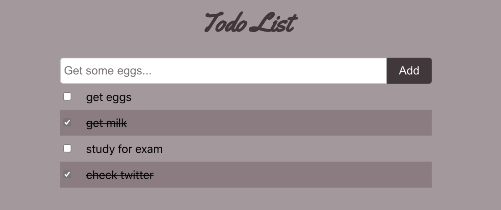

# Coding Challance React Todo List

This react coding challenge can be completed in your own time but you don't need to spend more than 1/2 hours to complete it. **We're looking for quality code not every single feature checked off, if you run out of time, commit what you have done and send it in with a note.**

1. Fork this repository to your own GitHub account.
2. Using the bootstrapped Create React App already set up in here, build a simple todo list app.
3. Check off all of the features below and add a bonus feature if you have time.
4. Commit your code, push it up and create a pull request back to this repository for review.

*Any questions, feel free to ask.* 
## Core Features

- [ ] Add a checklist item to the list
- [ ] Remove a checklist item from the list
- [ ] Mark checklist items and complete and incomplete
### Bonus points:

- [ ] Spliting your coding into logical, DRY, nested components
- [ ] Define your PropTypes
- [ ] Build out 1 or 2 JEST tests for core parts of your work
## Tips

- Use only [Functional Components](https://reactjs.org/docs/components-and-props.html#function-and-class-components).
- Checklist items only need to be stored in local application state, no need to use backend a backend/API/advanced state for this project.
- You can use a UI framework like [Material UI](https://material-ui.com/) or [React Bootstrap](https://react-bootstrap.github.io/).

Good luck! Ben @ Indie.
# Getting Started with Create React App

This project was bootstrapped with [Create React App](https://github.com/facebook/create-react-app).

## Available Scripts

In the project directory, you can run:

### `yarn start`

Runs the app in the development mode.\
Open [http://localhost:3000](http://localhost:3000) to view it in the browser.

The page will reload if you make edits.\
You will also see any lint errors in the console.

### `yarn test`

Launches the test runner in the interactive watch mode.\
See the section about [running tests](https://facebook.github.io/create-react-app/docs/running-tests) for more information.

### `yarn build`

Builds the app for production to the `build` folder.\
It correctly bundles React in production mode and optimizes the build for the best performance.

The build is minified and the filenames include the hashes.\
Your app is ready to be deployed!

See the section about [deployment](https://facebook.github.io/create-react-app/docs/deployment) for more information.

### `yarn eject`

**Note: this is a one-way operation. Once you `eject`, you can’t go back!**

If you aren’t satisfied with the build tool and configuration choices, you can `eject` at any time. This command will remove the single build dependency from your project.

Instead, it will copy all the configuration files and the transitive dependencies (webpack, Babel, ESLint, etc) right into your project so you have full control over them. All of the commands except `eject` will still work, but they will point to the copied scripts so you can tweak them. At this point you’re on your own.

You don’t have to ever use `eject`. The curated feature set is suitable for small and middle deployments, and you shouldn’t feel obligated to use this feature. However we understand that this tool wouldn’t be useful if you couldn’t customize it when you are ready for it.

## Learn More

You can learn more in the [Create React App documentation](https://facebook.github.io/create-react-app/docs/getting-started).

To learn React, check out the [React documentation](https://reactjs.org/).

### Code Splitting

This section has moved here: [https://facebook.github.io/create-react-app/docs/code-splitting](https://facebook.github.io/create-react-app/docs/code-splitting)

### Analyzing the Bundle Size

This section has moved here: [https://facebook.github.io/create-react-app/docs/analyzing-the-bundle-size](https://facebook.github.io/create-react-app/docs/analyzing-the-bundle-size)

### Making a Progressive Web App

This section has moved here: [https://facebook.github.io/create-react-app/docs/making-a-progressive-web-app](https://facebook.github.io/create-react-app/docs/making-a-progressive-web-app)

### Advanced Configuration

This section has moved here: [https://facebook.github.io/create-react-app/docs/advanced-configuration](https://facebook.github.io/create-react-app/docs/advanced-configuration)

### Deployment

This section has moved here: [https://facebook.github.io/create-react-app/docs/deployment](https://facebook.github.io/create-react-app/docs/deployment)

### `yarn build` fails to minify

This section has moved here: [https://facebook.github.io/create-react-app/docs/troubleshooting#npm-run-build-fails-to-minify](https://facebook.github.io/create-react-app/docs/troubleshooting#npm-run-build-fails-to-minify)
